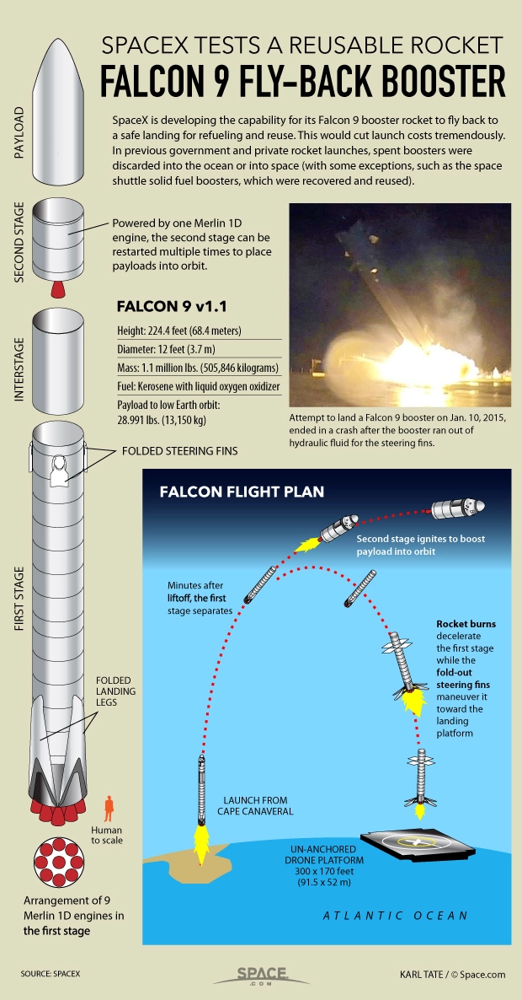
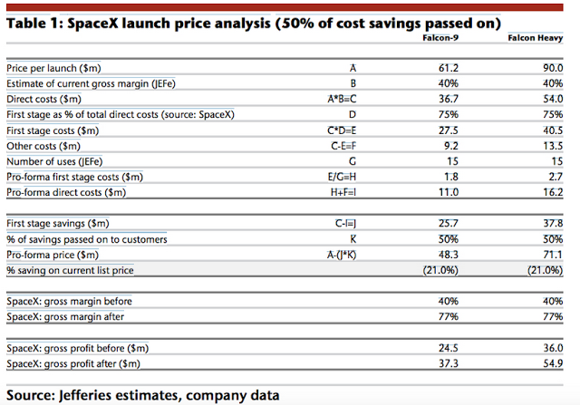

<h1>Introduction</h1>

The increasing demand for improved space technology and advancements in space tourism and travel have necessitated developments in launch vehicle technology. Traditional one-time-use boosters and rockets are inefficient and both financially and environmentally costly, leading to the pursuit of reusable alternatives. SpaceX’s extensive work developing their flagship rockets, such as the Falcon 9 and, more recently, the Starship and its super heavy systems have redefined booster recovery through propulsive landing and mid-air catching techniques. 
This article focuses on the mechanics, challenges, and advancements in SpaceX’s booster recovery systems, which led to the historic Starship booster catch on Oct 13, 2024.

 

<h1>Engineering Principles of booster recovery</h1>

<h2>Controlled descent and aerodynamics</h2>

The descent of a body (in our case, a booster) to Earth is governed by the combination of a few forces - gravity, drag, and thrust. During re-entry, the booster undergoes rapid changes in temperature and velocity, reaching temperatures close to half the temperatures of the sun ( >5000 degrees F) and supersonic to subsonic transition phases, posing unique aerodynamic challenges:

<ul type="none">

<li>a) <i>Reynolds and Mach number variations</i>:   The booster transitions through a high Reynolds number regime due to increased density and particle (the booster) velocity, and a compressible flow regime with Mach numbers exceeding 5. SpaceX uses grid fins made of titanium to address aerodynamic instability. They are designed for precision and have a withstanding nature in hypersonic and subsonic flow control.</li>
 

<li>b) <i>Re-entry plasma sheath formation</i>: While the booster re-enters the atmosphere, friction generates a plasma sheath, which can disrupt communications. SpaceX addresses this using fault-tolerant Inertial Guidance Systems (INS), which reduces dependency on GPS in critical stages. How INS works is similar to the motion tracking in a Wii remote- with the help of accurate accelerometers and gyroscopes that transmit and receive constant feedback from a computer processing the input data, the orientation, acceleration, position, and velocity of the body with respect to its initial position is realized.</li>
</ul>

<h2>Propulsive deceleration</h2>

The Falcon 9 employs Merlin engines to decelerate from free fall into a controlled descent. The Thrust-to-Weight Ratio (TWR) is dynamically adjusted and precisely calculated in real-time to ensure a soft landing without structural overload. 
A basic equation pertaining to deceleration in this context is:

<math display="block">
<msub><mi>F</mi><mi>t</mi></msub><mo>=</mo><mi>m</mi><mi>g</mi><mo>+</mo><mfrac><mn>1</mn><mn>2</mn></mfrac><mi>&rho;</mi><msup><mi>v</mi><mn>2</mn></msup><msub><mi>C</mi><mi>d</mi></msub><mi>A</mi>
</math>

Where:

<ul type="none">
<li><math><msub><mi>F</mi><mi>t</mi></msub></math>: Thrust required for deceleration (approximately equal to the weight of the rocket at the time of the docking, as acceleration will be negligible in the former)</li> 

<li><math><mi>m</mi></math>: Mass of the booster</li> 

<li><math><mi>g</mi></math>: Gravitational acceleration</li> 

<li><math><mi>&rho;</mi></math>: Air density</li> 

<li><math><mi>v</mi></math>: Velocity during descent</li> 

<li><math><msub><mi>C</mi><mi>d</mi></msub></math>: Drag coefficient</li> 

<li><math><mi>A</mi></math>: Area of the cross-section</li>

</ul>

 

<h1>The <i>Mechazilla</i> catch system</h1>

<h2>System Overview</h2>

The Mechazilla system uses massive robotic ‘arms’ attached to the launch tower to catch the descending Super Heavy booster in mid-air. This eliminates the requirement of landing legs on the booster, reducing weight and improving payload performance.

<h2>Kinematic and dynamic modelling</h2>

Catching a booster mid-air requires precise control of the robotic arms’ velocity and position. An example of a kinematic equation with vector algebra governing this synchronization is as follows:

<math display="block">
<msub><mover><mi>r</mi><mo>&rarr;</mo></mover><mi>catch</mi></msub><mo>=</mo><msub><mover><mi>r</mi><mo>&rarr;</mo></mover><mi>booster</mi></msub><mo>+</mo><mi>&Delta;</mi><mover><mi>r</mi><mo>&rarr;</mo></mover><mi>(</mi><mi>t</mi><mi>)</mi>
</math>

Where:

<ul type="none">
<li><math><msub><mover><mi>r</mi><mo>&rarr;</mo></mover><mi>catch</mi></msub></math>: Position vector of the robotic arm</li> 

<li><math><msub><mover><mi>r</mi><mo>&rarr;</mo></mover><mi>booster</mi></msub></math>: Predicted trajectory of the booster</li> 

<li><math><mi>&Delta;</mi><mover><mi>r</mi><mo>&rarr;</mo></mover><mi>(</mi><mi>t</mi><mi>)</mi></math>: Real-time adjustments based on atmospheric perturbations</li> 

</ul>

The dynamic stress analysis of the arms and attachment points considers load distribution during the catch can be modelled by:

<math display="block">
<msub><mi>&sigma;</mi><mi>max</mi></msub><mo>=</mo><mfrac><mi>F</mi><mi>A</mi></mfrac><mo>+</mo><mfrac><mrow><mi>M</mi><mi>d</mi></mrow><mi>I</mi>
</math>

Where:

<ul type="none">
<li><math><msub><mi>&sigma;</mi><mi>max</mi></msub></math>: Maximum stress on the arms</li> 

<li><math><mi>F</mi></math>: Contact force applied during the catch</li> 

<li><math><mi>A</mi></math>: Cross-sectional area of the arms</li> 

<li><math><mi>M</mi></math>: Moment due to angular acceleration</li> 

<li><math><mi>d</mi></math>: Distance from the pivot</li> 

<li><math><mi>I</mi></math>: Moment of Inertia</li> 

</ul>
 

<h1>Materials and Structural Integrity</h1>

<h2>Thermal Protection Systems (TPS)</h2>

The extremely high temperatures the boosters encounter ranges from 1,500K to 5,000K during re-entry. SpaceX uses ablative TPS (This type of TPS sacrifices itself, eroding away while absorbing and dissipating the heat, and is generally made of materials like PICA or C-Ph) and reinforced Carbon-Carbon composites in critical areas for structural integrity and to dissipate heat. These materials undergo extensive testing to withstand thermal cycling without extensive degradation.

<h2>Fatigue and Longevity</h2>

Reusable systems require materials that can endure multiple launch and recovery cycles without failure. Finite element analysis (FEA) predicts fatigue life, focusing on high-stress regions such as engine mounts and structural joints.

 

<h1>Guidance and Navigation Systems</h1>

SpaceX’s success in booster recovery hinges on accurate real-time positioning, for which GNS plays a major part, ensuring precise manoeuvring during descent and landing. GNS consists of real-time data processing, advanced algorithms, and robust data networks, with Deep Learning being looked into for inclusion in existing systems.

<h2>Inertial Navigation Systems (INS)</h2>

Without external references, INS relies on gyroscopes and accelerometers to determine position, velocity, and orientation. Some equations of motion governing the INS include:

<math display="block">
<mover><mover><mi>r</mi><mo>&rarr;</mo></mover><mo>.</mo></mover><mo>=</mo><mover><mi>v</mi><mo>&rarr;</mo></mover>
</math>
 

<math display="block">
<mover><mover><mi>v</mi><mo>&rarr;</mo></mover><mo>.</mo></mover><mo>=</mo><msub><mover><mi>a</mi><mo>&rarr;</mo></mover><mi>sensor</mi></msub><mo>-</mo><mn>2</mn><msub><mover><mi>&omega;</mi><mo>&rarr;</mo></mover><mi>E</mi></msub><mo>&times;</mo><mover><mi>v</mi><mo>&rarr;</mo></mover><mo>-</mo><msub><mover><mi>&omega;</mi><mo>&rarr;</mo></mover><mi>E</mi></msub><mo>&times;</mo><mo>(</mo><msub><mover><mi>&omega;</mi><mo>&rarr;</mo></mover><mi>E</mi></msub><mo>&times;</mo><mover><mi>r</mi><mo>&rarr;</mo></mover><mo>)</mo><mo>+</mo><mover><mi>g</mi><mo>&rarr;</mo></mover>
</math>

Where:

<ul type="none">
<li><math><mover><mi>r</mi><mo>&rarr;</mo></mover></math>: Position vector relative to the Earth</li> 

<li><math><mover><mi>v</mi><mo>&rarr;</mo></mover></math>: Velocity vector</li> 

<li><math><mover><mi>a</mi><mo>&rarr;</mo></mover></math>: Specific acceleration measured by the accelerometers</li> 

<li><math><msub><mover><mi>&omega;</mi><mo>&rarr;</mo></mover><mi>E</mi></msub></math>: Earth's angular velocity vector</li> 

<li><math><mover><mi>g</mi><mo>&rarr;</mo></mover></math>: Gravity vector</li> 

</ul>

<h2>Kalman Filtering</h2>

SpaceX employs Kalman filtering for sensor fusion to mitigate sensor noise and errors. The Kalman filter prediction and update equations are:

<math display="block">
<msub><mover><mi>x</mi><mo>^</mo></mover><mrow><mi>k</mi><mo>&verbar;</mo><mi>k</mi><mo>-</mo><mn>1</mn></mrow></msub><mo>=</mo><msub><mi>F</mi><mi>k</mi></msub><msub><mover><mi>x</mi><mo>^</mo></mover><mrow><mi>k</mi><mo>-</mo><mn>1</mn><mo>&verbar;</mo><mi>k</mi><mo>-</mo><mn>1</mn></mrow></msub><mo>+</mo><msub><mi>B</mi><mi>k</mi></msub><msub><mi>u</mi><mi>k</mi></msub>
</math>
 

<math display="block">
<msub><mi>P</mi><mrow><mi>k</mi><mo>&verbar;</mo><mi>k</mi><mo>-</mo><mn>1</mn></mrow></msub><mo>=</mo><msub><mi>F</mi><mi>k</mi></msub><msub><mi>P</mi><mrow><mi>k</mi><mo>-</mo><mn>1</mn><mo>&verbar;</mo><mi>k</mi><mo>-</mo><mn>1</mn></mrow></msub><msubsup><mi>F</mi><mi>k</mi><mi>T</mi></msubsup><mo>+</mo><msub><mi>Q</mi><mi>k</mi>
</math>
 

<math display="block">
<msub><mi>K</mi><mi>k</mi></msub><mo>=</mo><msub><mi>P</mi><mrow><mi>k</mi><mo>&verbar;</mo><mi>k</mi><mo>-</mo><mn>1</mn></mrow></msub><msubsup><mi>H</mi><mi>k</mi><mi>T</mi></msubsup><msup><mrow><mo>(</mo><msub><mi>H</mi><mi>k</mi></msub><msub><mi>P</mi><mrow><mi>k</mi><mo>&verbar;</mo><mi>k</mi><mo>-</mo><mn>1</mn></mrow></msub><msubsup><mi>H</mi><mi>k</mi><mi>T</mi></msubsup><mo>+</mo><msub><mi>R</mi><mi>k</mi></msub><mo>)</mo></mrow><mn>-1</mn></msup>
</math>
 

<math display="block">
<msub><mover><mi>x</mi><mo>^</mo></mover><mrow><mi>k</mi><mo>&verbar;</mo><mi>k</mi></mrow></msub><mo>=</mo><msub><mover><mi>x</mi><mo>^</mo></mover><mrow><mi>k</mi><mo>&verbar;</mo><mi>k</mi><mo>-</mo><mn>1</mn></mrow></msub><mo>+</mo><msub><mi>K</mi><mi>k</mi></msub><mo>(</mo><msub><mi>z</mi><mi>k</mi></msub><mo>-</mo><msub><mi>H</mi><mi>k</mi></msub><msub><mover><mi>x</mi><mo>^</mo></mover><mrow><mi>k</mi><mo>&verbar;</mo><mi>k</mi><mo>-</mo><mn>1</mn></mrow></msub><mo>)</mo>
</math>

Where:

<ul type="none">
<li><math><msub><mover><mi>x</mi><mo>^</mo></mover><mrow><mi>k</mi><mo>&verbar;</mo><mi>k</mi></mrow></msub></math>: State estimate at step <i>k</i></li> 

<li><math><msub><mi>P</mi><mrow><mi>k</mi><mo>&verbar;</mo><mi>k</mi></mrow></msub></math>: Covariance</li> 

<li><math><msub><mi>F</mi><mi>k</mi></msub></math>: State transition</li> 

<li><math><msub><mi>B</mi><mi>k</mi></msub></math>: Control input model</li> 

<li><math><msub><mi>H</mi><mi>k</mi></msub></math>: Observation model</li> 

<li><math><msub><mi>Q</mi><mi>k</mi></msub></math>: Process covariance matrix</li> 

<li><math><msub><mi>R</mi><mi>k</mi></msub></math>: Noise covariance matrix</li> 

<li><math><msub><mi>K</mi><mi>k</mi></msub></math>: Kalman gain</li> 

</ul>

The Kalman Filter equations are extensively used in control systems engineering and are a powerful algorithm to estimate the state of a dynamic system from noisy measurements. It recursively updates a predicted state and its associated uncertainty based on new measurements. To explain the above equations in brief:

<ol>
<li>The first equation predicts the system’s state during step <i>k</i> given the previous state estimate <i>k-1</i> and the control input <math><msub><mi>u</mi><mi>k</mi></msub></math>. The control input is like an external input that drives and influences the system’s state. For example, <math><msub><mi>u</mi><mi>k</mi></msub></math> can represent a moving object's applied force/acceleration.</li> 

<li>The second equation predicts the uncertainty in the state estimate, with <math><msub><mi>P</mi><mrow><mi>k</mi><mo>&verbar;</mo><mi>k</mi><mo>-</mo><mn>1</mn></mrow></msub></math> being the predicted covariance matrix at a time of event <i>k</i> with information up to event <i>k-1</i> and <math><msub><mi>Q</mi><mi>k</mi></msub></math> being the noise covariance matrix, which models the uncertainty in the system dynamics. Covariant matrices help quantify the uncertainty or variability in a set of random variables and are essential to understanding the degree of uncertainty of our system. They also help adjust the uncertainty according to the constantly changing system state as per the output of the filter.</li> 

<li>The third equation calculates the Kalman gain <math><msub><mi>K</mi><mi>k</mi></msub></math> which determines how much weight should be added to the measurement update. <math><msub><mi>H</mi><mi>k</mi></msub></math> is the observation model that relates the system state to the measurement, and <math><msub><mi>R</mi><mi>k</mi></msub></math> is the noise covariance matrix.</li>
</ol>

<h2>Closed Loop Control</h2>

Like other space agencies globally, SpaceX uses proportional-integral-derivative (PID) controllers and advanced closed-loop algorithms for precise trajectory correction. The control law for a PID controller is:

<math display="block">
<mi>u</mi><mi>(</mi><mi>t</mi><mi>)</mi><mo>=</mo><msub><mi>K</mi><mi>p</mi></msub><mi>e</mi><mi>(</mi><mi>t</mi><mi>)</mi><mo>+</mo><msub><mi>K</mi><mi>i</mi></msub><msubsup><mo>&int;</mo><mn>0</mn><mi>t</mi></msubsup><mi>e</mi><mi>(</mi><mi>&tau;</mi><mi>)</mi><mi>d</mi><mi>&tau;</mi><mo>+</mo><msub><mi>K</mi><mi>d</mi></msub><mfrac><mi>d</mi><mrow><mi>d</mi><mi>t</mi></mrow></mfrac><mi>e</mi><mi>(</mi><mi>t</mi><mi>)</mi>
</math>

Where:

<ul type="none">
<li><math><mi>u</mi><mi>(</mi><mi>t</mi><mi>)</mi></math>: Control output (e.g., engine thrust adjustment)</li> 

<li><math><mi>e</mi><mi>(</mi><mi>t</mi><mi>)</mi></math>: Error signal (difference between desired and actual states)</li> 

<li><math><msub><mi>K</mi><mi>p</mi></msub></math>: Proportional gain</li> 

<li><math><msub><mi>K</mi><mi>i</mi></msub></math>: Integral gain</li> 

<li><math><msub><mi>K</mi><mi>d</mi></msub></math>: Derivative gain</li> 
</ul>

The first term on the RHS of the equation is the proportional term, having the proportional gain (<math><msub><mi>K</mi><mi>p</mi></msub></math>) and the error signal (<math><mi>e</mi><mi>(</mi><mi>t</mi><mi>)</mi></math>). The second term is integral, representing the errors accumulated over time and helping eliminate steady-state errors. The last and third term is the derivative gain term, which responds to the error rate of change, helping improve the system's response time and stability.

 

<h1>Atmospheric Perturbations</h1>

Re-entry involves the influence of complex atmospheric phenomena due to variable atmospheric conditions. Various factors can deviate the booster’s trajectory, further complicating aligning and attachment. This is addressed with predictive and adaptive modelling techniques.

<h2>Wind shear and turbulence</h2>

Wind shear causes abrupt changes in wind velocity with altitude, generating lateral forces. The governing force equation can be given as follows:

<math display="block">
<msub><mi>F</mi><mi>lateral</mi></msub><mo>=</mo><mfrac><mn>1</mn><mn>2</mn></mfrac><mi>&rho;</mi><msup><mi>v</mi><mn>2</mn></msup><mi>A</mi><msub><mi>C</mi><mi>y</mi></msub>
</math>

Where:

<ul type="none">
<li><math><mi>&rho;</mi></math>: Air density</li> 

<li><math><mi>v</mi></math>: Relative velocity </li> 

<li><math><mi>A</mi></math>: Area of the cross-section</li> 

<li><math><msub><mi>C</mi><mi>d</mi></msub></math>: Side force coefficient</li> 

</ul>

<h2>Adaptive descent profiles</h2>

The boosters would require real-time feedback to adapt the descent trajectory. The optimal descent trajectory minimizes total energy expenditure and maintains aerodynamic stability. It is derived by solving the following:

<math display="block">
<mtext>Minimize:</mtext><msubsup><mo>&int;</mo><msub><mi>t</mi><mn>0</mn></msub><msub><mi>t</mi><mi>f</mi></msub></msubsup><mo>(</mo><mi>&alpha;</mi><mo>&sdot;</mo><mi>&Delta;</mi><mi>v</mi><mo>+</mo><mi>&beta;</mi><mo>&sdot;</mo><msub><mi>F</mi><mi>drag</mi></msub><mo>)</mo><mi>d</mi><mi>t</mi>
</math>

Subject to constraints such that:

<math display="block">
<mi>h</mi><mi>(</mi><msub><mi>t</mi><mi>f</mi></msub><mi>)</mi><mo>=</mo><mn>0</mn><mo></mo><mtext>(&because; Final attitude at sea level)</mtext>
</math> 

<math display="block">
<mi>v</mi><mi>(</mi><msub><mi>t</mi><mi>f</mi></msub><mi>)</mi><mo>=</mo><mn>0</mn><mo></mo><mtext>(&because; Final velocity for soft landing)</mtext>
</math>
 

<h1>Challenges and Innovations</h1>

<h2>Real-time decision making</h2>

Real-time corrections for unexpected conditions, like higher-than-predicted drag, GPS signal loss, or instrument interference, can be addressed efficiently with advanced AI. SpaceX boosters employ ML models trained on historical flight data to predict failure points and adjust attachment trajectories dynamically.

<h2>Energy management</h2>

Overall energy is the sum of several components, such as potential, kinetic, and thermal energy. Optimal energy distribution between aerodynamic braking, propulsive deceleration, and structural integrity is critical.

Thermal energy is minimized by leveraging aerodynamic drag during the hypersonic phase (>Mach 5) and switching to propulsive breaking in the terminal stages.

<h2>Material fatigue and refurbishment</h2>

The booster undergoes several extreme stress cycles due to micro-vibrations, thermal expansion, and mechanical loads. Fatigue analysis is given by:

<math display="block">
<mi>N</mi><mo>=</mo><mfrac><mn>1</mn><mrow><mi>A</mi><mi>(</mi><mi>&Delta;</mi><mi>&sigma;</mi><msup><mi>)</mi><mi>m</mi></msup></mrow></mfrac>
</math>

Where:

<ul type="none">
<li><math><mi>N</mi></math>: Number of cycles to failure</li> 

<li><math><mi>A</mi><mo>,</mo><mi>m</mi></math>: Material constants</li> 

<li><math><mi>&Delta;</mi><mi>&sigma;</mi></math>: Stress amplitude</li> 

</ul>

Refurbishment processes such as non-destructive testing (NDT) are performed to ensure that the boosters are flight-ready for multiple missions. NDT helps to identify cracks and flaws, assess the material’s material properties, track changes in the components’ health, and ensure safety and reliability.

 

<h1>Full-System Reusability: The Next Frontier</h1>

The recovery of rocket boosters is the start of a brisk sprint in the marathon of achieving full-system reusability. This would include second stages and payload fairings (the protective structures enclosing a rocket's payload) and presents additional engineering and economic challenges.

<h2>Recovery of second stages</h2>

Unlike boosters, the second stages are detached in near-vacuum conditions and re-enter at much higher speeds, leading to greater thermal loads and material stress. The main challenges are:

<ul type="none">

<li>a) <i>Orbital velocity</i>: The second stage must decelerate from orbital velocities (~7.8 km/s), necessitating advanced propulsion systems for controlled and stable re-entry.</li>
 

<li>a) <i>Aerodynamic Stress</i>: Since the re-entry profile of a second stage is significantly steeper than that of the first stage booster, robust thermal protection systems are required to manage high temperatures.</li>
 

<li>b) <i>Guided Re-Entry</i>: First-stage boosters use grid fins for aerodynamic control, whereas the second stages rely on reaction control systems (RCS) and precise thrust-vectoring. RCS typically uses a set of small thrusters mounted on the spacecraft’s exterior, which are fired in various combinations to generate specific torques and forces to control the spacecraft’s orientation and position.</li>
</ul>

<h2>Materials for multi-stage reusability</h2>

The choice of materials in the second stage differs due to the harsher re-entry conditions. The starship booster used by SpaceX uses a special stainless steel variant that combines high-temperature tolerance with ductility and is designed to endure repeated thermal cycling with little to no degradation.

<h2>The role of <i>Mechazilla</i> in full recovery</h2>

The <i>Mechazilla</i> has several unique engineering challenges:

<ol>
<li><i>Synchronisation</i>: The robotic arms that catch the boosters must match the booster’s velocity, orientation, and acceleration with millimeter accuracy. The position vector of the arms dynamically adjusts itself to match that of the booster due to deviations in wind or thrust misalignments.</li> 

<li><i>Dynamic load distribution</i>: The robotic arms experience significant impact and contact forces during the catch, and stress analysis must ensure the tower structure remains stable under these loads.</li>
</ol> 

<h1>Economic and Environmental Implications</h1>

<h2>Cost reductions</h2>

NASA spends an abrasive amount on improving, developing, and launching its non-reusable SLS (Solid Launch System) boosters. In contrast, SpaceX has reported that reusing boosters can save up to 70% of the total launch cost, with a single Falcon 9 booster supporting dozens of flights (while experts say it’ll last for fifteen). This cost efficiency makes it an attractive option for smaller companies and research agencies, who can launch satellites at cheaper prices.

<h2>Environmental benefits</h2>

The reusability of boosters reduces the environmental impact by reducing waste and also helps reduce space junk, a growing issue. However, the production and refurbishment processes still involve energy-intensive operations. Future advancements in green manufacturing and propellant recovery can reduce environmental impact.

 

<h1>Theoretical and Experimental Research Insights</h1>

<h2>Optimization Models for booster recovery</h2>

Several research papers have been published to explore the optimization of guided rocket booster recovery trajectories. Some studies propose advanced control algorithms that integrate:

<math display="block">
<mi>J</mi><mo>=</mo><msubsup><mo>&int;</mo><mn>0</mn><mi>T</mi></msubsup><mo>(</mo><mi>&alpha;</mi><mo>&sdot;</mo><msub><mi>E</mi><mi>fuel</mi></msub><mo>+</mo><mi>&beta;</mi><mo>&sdot;</mo><mi>&Delta;</mi><mi>v</mi><mo>+</mo><mi>&gamma;</mi><mo>&sdot;</mo><msub><mi>P</mi><mi>structural</mi></msub><mo>)</mo><mi>d</mi><mi>t</mi>
</math>

Where:

<ul type="none">
<li><math><mi>J</mi></math>: Total cost function</li> 

<li><math><msub><mi>E</mi><mi>fuel</mi></msub></math>: Fuel expenditure during descent</li> 

<li><math><mi>&Delta;</mi><mi>v</mi></math>: Change in velocity to achieve controlled landing</li> 

<li><math><msub><mi>P</mi><mi>structural</mi></msub></math>: Predicted structural stresses during recovery</li> 

<li><math><mi>&alpha;</mi><mo>,</mo><mi>&beta;</mi><mo>,</mo><mi>&gamma;</mi></math>: Weighing factors for multi-objective optimization</li> 

</ul>

<h2>Advances in CFD Modeling</h2>

CFD plays an important role in optimizing booster recovery. Solving the Navier-stokes equations in real-time, optimizing the grid fins to get the maximum lift-to-drag ratio, and heat flux modeling to address the re-entry heat flux generated. These simulations guide the design of thermal protection systems (TPS, as discussed previously) to withstand extreme re-entry temperatures.

 

<h1>Future Challenges and Research Directions</h1>

Despite its successes, SpaceX has faced several challenges in achieving full-system reusability for every mission profile. Some of these challenges in its application for their long-term goal of <i>Project Mars</i> include:

<ul type="none">

<li>a) <i> Scaling Up for Interplanetary Missions</i>: Reusable systems in Mars missions should be capable of enduring harsher atmospheric conditions during descent and ascent. The Mars atmosphere is thinner, which leads to lesser aerodynamic drag to slow down the boosters and requires reliance on costlier deceleration methods, such as parachutes and retro-rockets. The frequent and unpredictable dust storms on Mars also amount to unpredictable aerodynamic forces, leading to increased heating and potential damage to the spacecraft.</li>
 

<li>a) <i>Long-Term Material Durability</i>:  Repeated exposure to extreme Martian conditions can lead to fatigue in the materials over extended periods, necessitating innovations in composite and metallic alloys.</li>
 

<li>b) <i>Integration of AI in recovery systems</i>: AI and ML can further enhance trajectory prediction and robotic synchronization for mid-air catching systems but require a lot of test data.</li>
</ul>
 

<h1>Conclusion</h1>

SpaceX’s pursuit of reusability represents one of the most significant advancements in aerospace engineering. By catching rocket boosters and pushing the boundaries of recovery systems, the company has transformed the economics and boundaries of space exploration. The engineering challenges overcome, ranging from aerodynamic control to robotic synchronization, offer a blueprint for future full-stage reusable launch systems.

As humanity makes a larger impact in Space and the planetary bodies around Earth, innovations like these mark a crucial milestone in making space travel more sustainable and accessible. With billions of dollars spent on ongoing research and technological advancements, SpaceX’s vision of fully reusable rockets has the full potential to become the standard for the next generation of rockets, shaping the new era of manned exploration beyond Earth’s orbit.

 

<h1>References</h1>
[1] - <a href="https://www.inverse.com/heres-how-spacexs-chopsticks-caught-a-rocket">Smith, K. (2024, October 15). Here’s How SpaceX’s “Chopsticks” Caught a Rocket In This Beautiful Engineering Feat. Inverse.</a> 

\[2] - <a href="https://doi.org/10.1016/j.actaastro.2021.08.017">Ma, B., Li, J., Zhang, Z., Xi, Y., Zhao, D., & Wang, N. (2021). Experimental and theoretical studies on thermoacoustic limit cycle oscillation in a simplified solid rocket motor using flat flame burner. Acta Astronautica, 189, 26–42. </a>

\[3] - <a href="https://doi.org/10.1088/1742-6596/2364/1/012020">Zhang, Y., Zhao, M., Tao, Z., Mao, W., Luo, S., Bai, X., & Peng, K. (2022). Design and optimization of booster gliding model guided rocket scheme. Journal of Physics Conference Series, 2364(1), 012020.</a>

\[4] - <a href="https://doi.org/10.14311/mad.2018.02.02">Tománek, R., & Hospodka, J. (2018). Reusable Launch Space Systems. MAD - Magazine of Aviation Development, 6(2), 10–13.</a>

\[5] - <a href="https://spacenews.com/spacex-aims-to-follow-a-banner-year-with-an-even-faster-2018-launch-cadence">Henry Caleb Gwynne Shotwell. SpaceX aims to follow a banner year with an even faster 2018 launch cadence, 2017.</a>

\[6] - <a href="https://www.spacex.com/media/Capabilities&Services.pdf.">Spacex capabilities & services, 2017.</a>

\[7] - C. J. Meisl, "Life Cycle Cost Considerations for Launch Vehicle Liquid Propellant Rocket Engines," in AIAA/ASME/SAE/ASEE 22nd Joint Propulsion Conference, Huntsville, 1986. 

\[8] -  M. M. Rogab, F. M. Cheatwood and S. J. Hughes, "Launch Vehicle Recovery and Reuse," in AIAA Space 2015 Conference and Exposition, Pasadena, 2015. 

\[9] - <a href="https://ntrs.nasa.gov/api/citations/20170000606/downloads/20170000606.pdf">Unknown Unknown, U., Unknown. (n.d.). A FRAMEWORK FOR ASSESSING THE REUSABILITY OF HARDWARE (REUSABLE ROCKET ENGINES). In Unknown.</a>

\[10] - <a href="https://www.space.com/spacex-starship-super-heavy-chopsticks-catch-near-abort">Wall, M. (2024, October 28). SpaceX’s Starship booster was “1 second away” from aborting epic launch-tower catch. Space.com.</a>

\[11] - <a href="https://arstechnica.com/space/2023/05/a-new-report-finds-nasa-has-spent-an-obscene-amount-of-money-on-sls-propulsion/">Berger, E., & Berger, E. (2023, May 30). A new report finds NASA has spent an obscene amount of money on SLS propulsion. Ars Technica.</a>

\[12] - <a href="https://sites.pitt.edu/~budny/papers/8226.pdf">Adrian, H., Hyman, W., & University of Pittsburgh Swanson School of Engineering. (2018). REUSABLE LAUNCH SYSTEM: THE GATEWAY TO THE FUTURE OF SPACE TRAVEL \[Journal-article].</a>

\[13] - <a href="http://iacse.commercial-space.net/wp content/uploads/2008/10/iac-08d213.pdf">B. Bjelde, P, Capozzoli, G. Shotwell. “The SpaceX Falcon 1 Launch Vehicle Flight 3 Results, Future Developments and Falcon 9 Evolution.” IACSE. 2011.</a> 

\[14] - <a href="https://spacenews.com/spacexs-reusable-falcon-9-what-are-the-real-cost-savings-for-customers/">De Selding, P. B., & De Selding, P. B. (2023, January 23). SpaceX’s reusable Falcon 9: What are the real cost savings for customers? SpaceNews.</a>

\[15] - nss.org/wp-content/uploads/2017/07/To-The-Stars-011-2015-apr.pdf

\[16] - <a href="https://www.inverse.com/article/59036-starship-here-s-where-spacex-wants-to-land-on-mars">Brown, M. (2019, September 5). Starship: Here’s Where SpaceX Wants to Land on Mars. Inverse.</a>