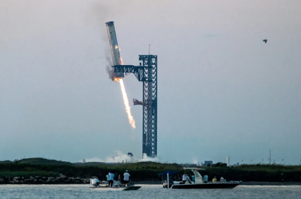

<h1>Introduction</h1>
The increasing demand for improved space technology and advancements in space tourism and travel have necessitated developments in launch vehicle technology. Traditional one-time-use boosters and rockets are inefficient and both financially and environmentally costly, leading to the pursuit of reusable alternatives. SpaceX’s extensive work developing their flagship rockets, such as the Falcon 9 and, more recently, the Starship and its super heavy systems have redefined booster recovery through propulsive landing and mid-air catching techniques. 
This article focuses on the mechanics, challenges, and advancements in SpaceX’s booster recovery systems, which led to the historic Starship booster catch on Oct 13, 2024.

<h1>Engineering principles of booster recovery</h1>

