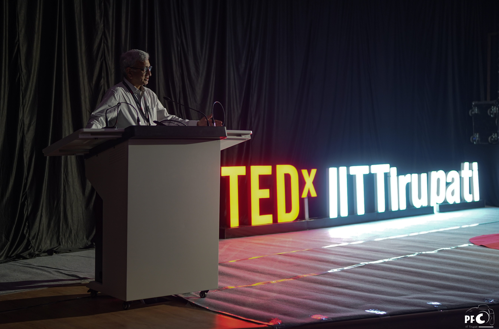
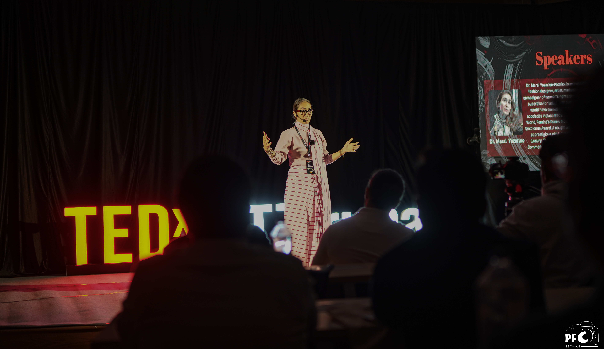
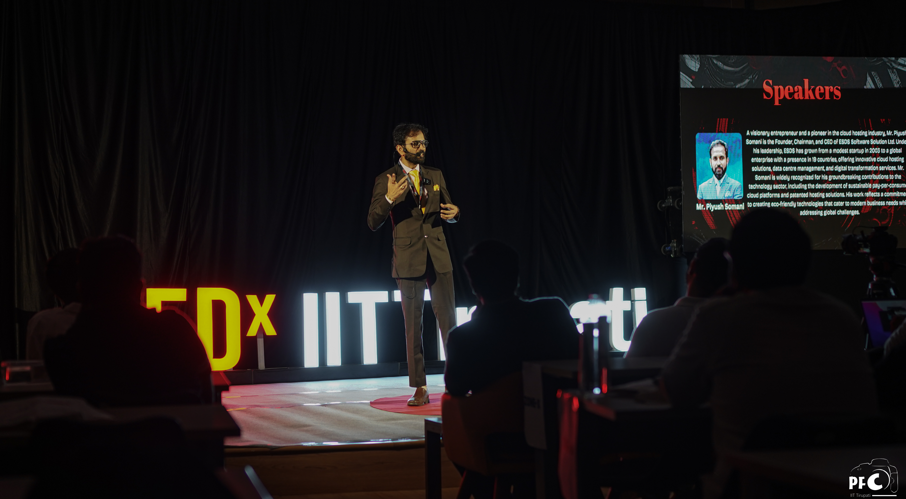
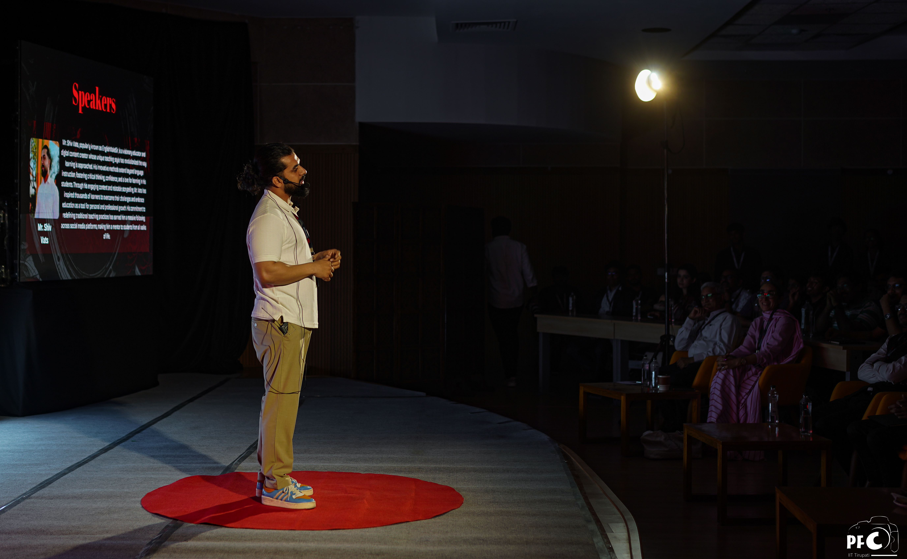
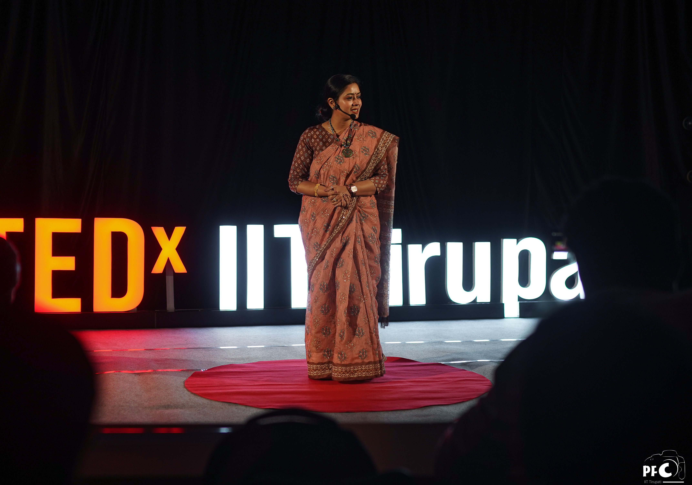

Behold! IIT Tirupati just hosted its first-ever TEDx talk, and we at Udaan cannot be more in awe of the dedication, sincerity and hard work that brought this incredible event to life.

We had the pleasure of interviewing the dynamic duo behind it – Divij Gupta and Yuvraj, two buzzing third years majoring in Electrical Engineering. They were kind enough to share the behind-the-scenes with us, and we now present it to you!
 

<h3>Walk us through the journey, starting from reaching out to the speakers and ending with sending them off. Who was behind the speaker nominations? How did the decision-making process go?</h3>

The speaker selection process was quite a tumble of effort, experiences, rejections, and harsh realisations. The curation team, which was meticulously selected with much caution and thorough rounds of interviewing, were put up to the task of the major decisions, the theme, as well as finding our esteemed speakers.

Divij and Yuvraj describe how they went about this challenge:

> 
“So, the first step, I think, was to finalise our curation team. Because out of the many divisions of our TEDx team, the curation team was a major one, as they had the role of selecting speakers, finalising their talks, and topics as well. We took our other division members from our E-Cell members mostly, but we rolled out a Google form and took interviews specifically for selecting a curation team. 

The approach was to mail as many influential people as possible, as many profiles as we could. However, before that, the other major task they had was selecting the theme for the event (more on that later). Once we had a theme, we sat down and discussed a few categories or domains from which we could expect speakers. They could be entrepreneurs or from entertainment, sports, influencers, music, science and tech, art, etc. With these seven basic categories, we instructed our curation team to send cold emails, Instagram DMs, and calls to anyone and everyone who fit in those categories, with a target of contacting ten people per week per team member. Eventually, based on responses or lack thereof, we had to up that number to twenty. We ended up reaching out to around 200-250 people in total.”

 

 

<h3>What gave you the motivation to carry on?</h3>

It is common knowledge that the student community may be a little lazy when it comes to attending talk sessions or lectures. It was, interestingly, this very phenomenon that inspired and challenged Divij and Yuvraj to strive for the best while preparing to launch TEDx here.

> 
“We wanted to get some big names so we could attract people, being very honest. We even emailed Shah Rukh Khan. If you check our contact sheet, you’ll find that we have sent mails to Sundar Pichai, Tim Cook – many, many big names. We didn’t leave any stone unturned – from people with very humble backgrounds to big celebrities.”

These heavy efforts and heavier optimisms were met with some disappointment, however. About 70-80% of their emails were left unanswered. Others stated that they were busy on the given date or that giving a TEDx speech didn’t align with how some others operated. But soon, a few showed interest in the event and asked for more information. Setting up the event on the official TEDx website with Divij’s and Yuvraj’s contacts was even more of a boost, as people came forth to nominate themselves to be speakers. Another dilemma that came with this process was finding a balance in speaker backgrounds and speeches:

> 
“We shared our event details and theme with interested people, who then sent us their talk ideas. Then the question was, ‘Is this what we want to feature in our event?’ Like, there was a guy who wanted to speak about AI, but our initial plan was to not include many tech-related talks, because we’re already a technological institution. We wanted to bring something new to our campus, so that’s why we kept only one speaker from a technical background and the rest were from art, teaching, motorcycling, etc.”

When we asked them about how they turned down the other nominees, they shared with us an interesting story that involved good amounts of confusion and greater amounts of emotional distress.

> 
“There were some speakers who nominated themselves back in November and we had shared the theme with them, and they had submitted their talk ideas as well. One of them asked us to tell them about the next step as they had presented their talk plan. We were not in a position to confirm him as a speaker, though, as we were keeping our options open until Jan 1st, the targeted finalising date. So we told him that we’d keep him updated, but he insisted as he was in Saudi Arabia and he would have to clear his calendar.

We had to turn him down eventually, so we asked our team to send them a polite email saying, ‘We are not in a position to confirm your availability, but if you want to know immediately, then you are not in one of our fixed speaker slots, as no one really is either. We may only be able to confirm by Jan 1st.’

He said that we couldn’t do that to him and that we should be taking him because we contacted him and kept him in the loop. He had apparently already told some of his colleagues and friends that he was going to be at TEDx with us, even though we did not send any confirmation email. So they didn’t take it very well and were quite upset. Eventually, after speaking to him over the phone, apologising and explaining our current plan and situation, he understood and agreed. There were several other cases where people weren’t happy about it, but yeah, it happens. We all learned from this experience.

Another story went like this: one speaker was tentatively finalised in early December. We were corresponding over mail, and he was free on the given day and interested in joining us, but at one point, a team member replied to one of his mails, and I don’t think the language was very clear. So the speaker interpreted it differently, and he sent back an email with the words, I remember, ‘Your email was too condescending.’ He said something like that and replied that he won’t come, saying things like we think we are superior to him and that we shouldn’t tell him how to speak. Basically, we shared the guidelines from TEDx, which we have to follow as license holders and which speakers have to follow for their talks to be published. It was our job to share those with all the speakers, and we told him that we were just messengers from TEDx for these guidelines. Eventually, they cancelled their talk, but I think looking back now, I really don’t regret with them not being a speaker, because all the other speakers who came were superb.”

 

<h3>How was the experience working with these people that came to speak and how did they fit in with the whole team? What were your favourite moments working with them?</h3>

One can agree that living college life day-to-day, attending classes, lying down on your bed for hours to stare at your ceiling, eating mess food and solving assignments, definitely gets interrupted with a jolt when you get to wake up one day to spend time with some of the most influential people across the country, or even the world. This particular editor would succumb to a nosebleed if you told her she could have lunch with THE Maral Yazarloo (she got to speak to her about getting a bike for 2 minutes and will never let that go). The TEDx team was certainly lucky to have worked with all five speakers, and we are all ears to hear the nitty-gritty of it.

>
“I mean, the overall experience of working with the five speakers was just awesome. Never in my life did I think I would get a chance to sit with Tanu Ma’am and share a meal with her or just sit and talk one-on-one. The same goes with all the speakers.

All the speakers who came, despite being so popular and having a huge fan following, were all super humble. When I was talking to them, it felt like I was talking to people like us only. They talked to us very calmly and politely, and I just love that about them. While booking rooms for them, we thought, ‘They won’t be happy staying in the guest house or eating the meals provided there.’ But when they reached there and had their first meal, I asked Dr. Dhruv Chauhan how he liked the food. To that, he replied, ‘I love this food, it’s like the food at home.’ They all preferred simplicity and were super okay with staying in the guest house. I can’t tell you how much that touched my heart. That’s another reason why I’m glad that we ended up with the speaker lineup that we had.

Another observation is how much they valued time. Even though this was just a couple days’ long affair, they wanted to leave ASAP and continue with their work. Even Mr. Piyush Somani wanted to leave on that day, a Sunday, for his own work. I remember that on Tuesday morning, Mr. Shiv Vats left for Delhi from Tirupati. Such a journey would take 2-3 days, but even that evening, he posted a reel on his Instagram. He posts something every day, and anyone would have just taken a day off if they were travelling, but he did not. That was quite impressive.

Another way they valued time was shown by how they said, ‘Now that we have come to Tirupati, we want to make the most of it. Show us some good places to visit here and what all we can try.’ Throughout their stay, they traveled to different places, explored, learned something new, and had new experiences. That’s what differentiates them from any other normal person. Consistency and value for time."

 

 

<h3>Other than these, were there any standalone favourite moments?</h3>

> 
[Yuvraj]: “I’ll tell mine, I’ll tell mine. My favourite moment was, I think, 10-15 days before the event. I was speaking to Mr. Shiv Vats on the phone, and he was like, ‘Okay, what do you want me to speak about?’ I said, ‘No, sir, you can just share your life story and how things happened in your life, which were unexpectedly good, according to the theme,’ after which he started narrating his life story to me. He told me how he was a backbencher and told me about some crazy incidents from then. You know, I never expected people to share such things generally; things like ‘I was not good at studies’ or ‘I still don’t know mathematics, differentiation, etc.’ or ‘I switched many schools and my teachers weren’t happy. ’ I asked him why was he sharing all this with me, and he said, ‘You are the organiser, you should know, right?’ I was getting such a good vibe at that time, and I realised that he was also like us. His life was very similar to ours at our age. I was able to relate to a lot of his cool experiences and I could see my younger self in his stories. We ended up talking for some 40-45 minutes on call that day.”

> 
[Divij]: “I have a story, but I won’t call it a favourite. It made me a little tense actually. A week before our event, I got a call from Mr. Piyush Somani’s manager. He said, ‘Divij, Mr. Piyush will not be available on 16th February.’ This was after we finalised and released everything, and everyone knew who the speakers were. Mr. Piyush had a meeting on that day, but I thought, ‘Who will have a meeting on Sunday?’ It turned out that he used to work on Sundays as well, and he was entirely booked on that weekend. I got very tense. Even our administration knew these people were coming. So I was literally begging, ‘Please come. This is our first time, and our institute's reputation is on the line. We will arrange everything for you.’ In the end, he was able to come, but he only stayed for some six hours and went back.”

> 
[Yuvraj]: “I have another story regarding how we got the idea to invite Dr. Dhruv Chauhan. We at IIT generally don’t know anybody from the medical field. During winter vacation, I was sitting with my sister, who is pursuing an MBBS degree, and I asked her if she had anyone in mind that we could call. She said, ‘Yeah, try Dhruv Chauhan sir. Anyway, you IITians will never look toward this side of the garden. It’ll be a unique opportunity to have this perspective. I found only his Instagram, so I texted him out of nowhere. I didn’t expect him to reply because he has 100k+ followers, but he replied in 10-15 minutes, so that was very shocking. Nowadays, you don’t expect quick replies from people, especially if they’re big. They usually read the notification and choose to reply later. So, this was actually very nice.”

> 
[Yuvraj]: “There was this other time when Dr. Tanu Jain, who is famous for taking interviews of UPSC aspirants, took my interview. We were having tea in the guest house while waiting for a cab, and she said, ‘Come, sit, let’s have a talk.’ And she proceeded to take a full-fledged UPSC interview, giving me insights and guiding me on what to do. Was I planning for UPSC? No. She still took my interview, asking me what my expectations for life were and what I wanted to achieve. So that was interesting.”

 

<h3>The question of the event – how did you select the theme? How did the brainstorming go, and what were the other topics that didn’t make the cut?</h3>

> 
“Honestly, we wanted our theme to be just open and creative. Crazy words joined up, sounding complicated. No one would know the meaning of these words – even I don’t understand it to this day. The audience would just come and see something unexpected or crazy. That was our main thing, to be a mystery, to generate curiosity in their mind. We also kept in mind that it should be very open-ended, which can work with any topic. Because with ‘Symphonies of Serendipity’, we never explicitly told our speakers how to make their talks. We just told them the theme and that they were free to speak on anything. It’s our job to make it fit with a theme.”

Brainstorming for theme ideas certainly would have been a task. It’s what would make or break the experience of the event. The TEDx curation team members were in charge of coming up with potential themes for the talk, after which they sat down together to discuss each one and filter them out. The final four warriors for the theme throne were ‘Mirrored Mysteries’, ‘Seeking the Sublime’, ‘Vellichor Visions’, and yours truly, ‘Symphonies of Serendipity’. These were quite a set of crazy words. I mean, what does ‘vellichor’ even mean? (The feeling of being in a bookstore or an old library. Something vintage, you know.)

You’d be surprised to know that after the team voted on themes, around 60% were in favour of ‘Seeking the Sublime’ and only 30-35% in favour of ‘Symphonies of Serendipity’. The heads confessed that they both favoured the former. This dilemma led them to ask AI which topic would work with more diverse topics, and that ultimately led to them choosing the theme that they did.

> 
“When we first saw this word ‘serendipity’, even our curation team was having difficulties in pronouncing it. In that way, ‘Mirrored Mysteries’ would have been easier to work with, but somehow, we ended up here. See how serendipitous it is that we got this theme. A lot of unexpectedly good things happened on this journey. I can write a whole essay on how many times people unexpectedly joined us when we needed something, from even the faculty side and the speaker side. So this theme represents the whole 3-4 months process.”

 

 

<h3>Moving on to the organisation of the whole event. What was the process of getting the TEDx license? What are you envisioning for the future TEDx organisers?</h3>

> 
“So, this isn't the first time we have applied for a TEDx license. Our previous head, Vaibhav, also applied for a TEDx license, which unfortunately got rejected because they felt that the tentative list for the topics was too monotonous. TED wanted more diversity in the topics, backgrounds, and domains. So, this time, we took more care with our answer. Some of the topics that we wrote down were ‘Morality in the Colonization of Mars’, ‘FOMO’, and ‘The Unseen Battle of Male Mental Health’. Regarding the Mars topic, it sounded like we'd speak about tech or rocket science,  but this topic was more of like is it ethical to even think of colonizing Mars? Humans are already depleting the resources of the earth, so what gives us the right to do the same thing to other planets in the cosmos? We don't need to stick to the topics mentioned on the list. It's just that they want to know how you think when you want to organise a TEDx event. Because TEDx talks are local events, right? They want local talent to come up on the stage and express what they have to show to their audience.

We applied for the license in September, and we got the license at the end of October. It took almost a month and a half. Last time, it got rejected in 3 days, so when they took longer to respond this time, we were a little confident that we would get it.

About the future of TEDxIITTirupati, I think starting is not that difficult. To continue it every year is going to be a more challenging task. The number of connections we have made and the new things that we got to learn from this experience are unmatched. We have to continue this and then try to scale up something every year. Like, if this time we called 5 speakers, maybe next time, you know, try to increase the number of speakers to 7 or 9 or something. Since our license limits us to an audience size of 100, we need to expand in other ways.”

 

<h3>You managed to draw in a large amount of participation from both within and outside our institute. How did you manage that, and what was it like on the field?</h3>

> 
“I think the full credit goes to the team. We had roles assigned for everyone on that day, whether it was to take registrations, guide the audience, give them goodies, etc. It was all planned out the day before, which was a major factor that helped in managing 100 people. Some of our audience members were from other colleges of Tirupati, some from Bangalore, Delhi, and so on. But I think the team managed it very well.

The day before the event, we were decorating the walls and putting up banners and posters, decorating the venue, setting up the stage, LED logo, and black screens. We made a list of what could go wrong, like the LED might stop working, the PPT might not work, the curtain might fall, and so on. The curtain actually fell, though, and we tried to fix it with a pin that had double tape on its back, but the pin was not able to carry the weight, and it would fall every five minutes. So we gave up on that.”

 

 

<h3>It sounds like a lot of work to keep tabs on – did something go wrong on the day of the event?</h3>

> 
“Fortunately, nothing went wrong during the event. That one curtain which we weren’t able to stick and keep up wasn’t working out. We tried everything and used whatever resources we had, but after everyone left on the previous day’s meeting and while we were both sitting there, it fell again. We had red and white balloons planned also, but they started popping with really loud sounds, which we didn’t want happening during the show, so we removed them. All those balloons are now in the Ideas Square room.

There was another 45-foot banner that we wanted to throw off the AB building. It was so heavy that it took three people to carry that banner on their shoulders to the rooftop. Then we thought, ‘If we throw it off the roof just like this, it would rip in between due to the weight.’ So, we had to tie the bottom of the poster in a specific way and slowly release it. We ran between floors trying to catch it and make it fall carefully. But that poster didn’t make it to the event day; we saw it lying down on the ground one day, and we texted our team to go pick it up and throw it in the dustbin so people wouldn’t think that the poster didn’t even make it to the final event.

We had something else in mind for that poster. We were planning on putting some confetti in it and then shooting a video of it being unrolled. It would have looked so nice. We also wanted to put props on the stage. Many things were planned but didn’t happen, but nobody actually noticed that."

 

<h3>Tell us all about the visual design.</h3>

The black-and-red T-shirts that we now see after the event always catch attention with their intricate design. Every element on that shirt looks so well put together, and it evokes a sort of thought process and a lasting impression as well, with the heart and the flora. Fitting, as TED has left its audience with long-lasting emotion and heart-touching stories. The goodies were all so beautiful, the stickers being visible around campus just as much as the shirts. The website, which we rushed to book our tickets, was flawless and fit the theme just as well. Overall, we can say that they did an impressive job maintaining the aesthetics of the event, which definitely had an impact on public appeal every time someone saw something related to TEDx promotions.

> 
“The designs for everything, from the tickets to the merch and t-shirts, were all developed by us and not externally. So, the full credit for all the inspiration, giant heart design, flowers, posters, etc., goes to our design team – Devotio, Divino and Manan. This is one of the teams that has impressed us a lot. Not only us, but everyone, to be frank. A lot of people asked us who our designers were. The Tirutsava guys were asking, too. We’d just tell our designers how we wanted things to work, and they would send over their design, which we would check, and they’d send their edits back. Most of the time, though, their first draft was super good already. One of the designs has a heart underneath a tree, and that tree is hand-drawn.

For the website, we had our web operations team — Vaibhav, Jaimin and Shankesh. We had our first design for the website in December, but we were too occupied with the curation process, so we only took a look at it in January when we came back to campus from the holidays. We met up, and when we saw the website, there were two eyes. It was not what we expected. Wherever you moved the cursor, the eyes followed you. So we told them, ‘This won’t do. We need to try something else.’ That night only, we sat till 6 am and refurbished and remade the website from scratch – each design and every element. Overall, we were able to create a good experience for the website.”

 

 

<h3>What about the setting up of the room and the production involved in that? Especially the black room that is such a trademark of TEDx?</h3>

> 
“Our initial motive was to make the room pitch dark. There were no shades or blinds in the room until last semester, which we were glad about. But then one day, we went to inspect them and we realised that those blinds alone wouldn’t be sufficient because they still let light into the room. Since our event was going to happen in the morning, we had to stick chart paper to the windows, which worked out.

The background of the stage is wooden, with a chalkboard and two projector screens. It’s not suitable for the TEDx pitch black setup. The wall was not really wooden, however. It was thin cardboard and made of some noise-absorbing material. We couldn’t hang curtains on it because it would break easily, so we contacted a vendor who brought metal stands for us to hang curtains on. Regarding the venue preparation, another challenge was the rotating chairs. Some of them were not in good condition. Since we’re charging people at least 400 rupees to attend, their experience shouldn’t be that their chair was bent or broken. We had to call EU 3-4 times, after which they welded the chairs and fixed them.”

Well, we know who to thank for the suddenly comfier seating in the LHC 240-seater now. This particular editor was just starting to enjoy her new classes there, with the spinny chairs to keep her entertained.

> 
“Mahesh sir from NSS helped us greatly with a lot of things. Curtains, lighting, everything. To be honest, we wouldn’t have been able to give this experience without him. He helped us in many places, from getting a good quotation for the goodies and setting up the venue to getting the right vendor contacts and sponsors, and so much more. A big shout-out to Mahesh sir. 

Lighting up the stage and the room was a challenge. The EU team came with some lights, but they were very small. It would look good on the face of the speaker, but they weren’t giving that much light in the 240-seater room. The shadows were a problem, too. The vendor we contacted didn’t have our requirements, either, because hardly ever does an indoor event happen with such a lighting setup. We sat with the vendor and showed him a couple of TEDx talks available on YouTube and explained our needs. It should not cover the entire room, it shouldn’t cover the background because the logo was self-illuminating, etc. We didn’t end up getting the correct lights for the event day also, but we made some modifications, and it eventually worked out.”

 

<h3>Looking back, is there anything you would have done differently? Any scopes of improvement you’d like to address?</h3>

> 
“I can’t think of any fatal thing.

I think this was our first time, so the scope of improvement should be based on this one. But, while approaching potential speakers, if I had the opportunity to go back, I wouldn’t approach some of them. Based on the experience I had, I’ll ask my team not to contact certain people because they’d just give us trouble later on.

The event looked how we expected it to look, but then there were things which were beyond our control. Anyway, we can’t do anything for that.”

 

<h3>Could you tell us about the different teams that you’d like to thank that made this vision materialise and share their contributions? Help us give them a shoutout!</h3>

<ol><li>
Curation Team – Mehak, Yogita, Bhavya, Neerav, Rupa, and Mrityunjay

Their job was to finalise the theme and approach the speakers, finalise the actual speakers, review their talks, share guidelines with them and make some edits in their talks if needed. The POC for each speaker was assigned from this team only. They also handled situations if the speakers were upset about any particular thing.
</li>

<li>
Design & Media Team – Manan, Devotio, and Divino

They were responsible for all the designs on our banners, posters, ID cards, social media posts, T-shirts, graphics and elements. Everyone who saw their designs loved them. They did a wonderful job. (Next time I need any design or anything, I’m going to go to them only.)
</li>

<li>
Web Operations Team – Vaibhav, Jaimin, and Shankesh

They were in charge of creating and crafting the website. They made two websites, and we went with the second. They put in a lot of effort and many sleepless nights. 3-4 sleepless nights where we went to sleep after seeing the sunrise and having breakfast. Setting up an official payment gateway for the first time in our college was one of the most hectic jobs, which was great work.
</li>

<li>
Production and Planning Team – Kaushik, Sai Srinivas, Ritvik, Rupesh, Puneet, and Pranesh

They took care of the venue and logistics, from setting up the stage to darkening the room, and going to Tirupati an uncountable number of times for different things, selling tickets to different colleges. They were also the first ones to come for meetings and the last to leave due to time-taking requirements.
</li>

<li>
Brand Vision Team – Soumya, Aadhya, and Chirag

Their role was to promote TEDx and make a brand out of it. All the reels on our social media and all the promotion around and outside the campus were done by them, which helped immensely. There are still many reels which they shot but never published online due to timing issues and other stuff. They put in a lot of effort, running around the whole day or taking pictures for different content.
</li>

<li>
Sponsorship Team – Vignesh, Pramod, Sathvika, and Rishi

This team was responsible for contacting potential companies that could sponsor us. They went to Tirupati on many days to contact businesses who were willing to sponsor us in any kind, be it monetary or non-monetary, or whether they could give us free goodies or discounts on raw materials, resources, and refreshments.
</li></ol>

> 
“We’d also like to thank the faculty members, Dr. Vishnu and Dr. Vaneet. Vaneet sir was the one who recommended Mr. Shiv Vats to us. We all know how much value his talk brought to the event; he’s a true gentleman.

> 
Another huge shoutout to Mr. Mahesh, who is the principal coordinator of NSS. As I mentioned before, this event wouldn’t have been possible without him. Even on Sundays, he would come to the venue when the vendors were there, and he would stay for a few hours. It meant a lot to us. One time we called him, and said worriedly, ‘Sir, all these things are still remaining. How should we do it?’ He told us to relax and that he would take care. When the event day came, all those things came out of nowhere, and they were all set up. We were not able to get good snack boxes and refreshments for participants, so he suggested a lot of things to us. That helped us get permits, licenses, memberships, and whatnot. He actually helped us a lot.

> 
A huge thank you to the Dean of Student Affairs, Dr. N. N. Murty, for the trust he has shown us, and the immense support with administration approvals, allocating and utilising funds, and guiding us with our approach.

Another huge thank you to our Assistant Registrar sir, Mr. Venkata Ramana, who also helped us greatly with payments.

And of course, immense gratitude to our Director sir, Dr. K. N. Satyanarayana, who came all the way from a family function in Hyderabad that day to specially attend our event. We’re glad that we could deliver.”

> 
[Yuvraj]: “I really want to thank Divij, because while managing this event with him, it never felt like ‘managing’. I felt like I enjoyed it, to be honest. I’ve worked with other people as well, and it happens that your energy won’t match with your team members, but that never happened with Divij from day one. One of the things we both share is that urge for perfection. Like when we’re aiming to do something, we somehow agree and get to a common conclusion, and then we both work for it. I cannot expect all the team members to have the same level of commitment as Divij or me, but the best part was that Divij and I had the same level of commitment. That was what kept me going. There were times when I felt lousy and didn’t want to go, but I’d see Divij already working on some finances, and I’d get up because I couldn’t watch him working alone.

During this whole process, we were also leading E-Cell together. I built some kind of trust in him that when I knew he was working on something, I knew I didn’t need to worry about it, and I could focus on my own work. Without him, I wouldn’t have been able to lead this team in the way we were able to.”

> 
[Divij]: “I feel the same towards you guys. And I think that he (Yuvraj) has done a greater job than me. Throughout this whole time, I was just supporting him. He has taken far many great decisions than I could ever imagine. Sometimes when I was like, ‘I don’t want to do this. I just want to sleep,’ he would say, ‘Leave it, we’ll chill for now and see tomorrow.’ There were many times that he supported me and was optimistic about seeing how it went. ‘We’ll take whatever decision we want to, and we’ll see what the consequences are.’ So I think he was the main character of this whole TEDxIITTirupati event. We were together wherever we were. A huge, huge thank you to Yuvraj for taking all this initiative.”

 

<h3>After such a wonderful session of recalling and storytelling and sharing knowledge, we move on to wrapping things up. Yuvraj and Divij, do you have any closing remarks for us?</h3>

> 
“Closing remarks? No, these were the closing remarks.

Thank you, Udaan, for interviewing us. Never thought my work would one day be considered worthy of an interview. And thank you to our hosts, Ritvik and Samara.

We’re already running very late. It’s 1 am. 2 hours. A 2-hour long interview. Almost a good podcast. We could do a podcast. We could do both. Cut out some parts, though, don’t include all of it…” 

 

<i>Voices fade into the background...</i>

